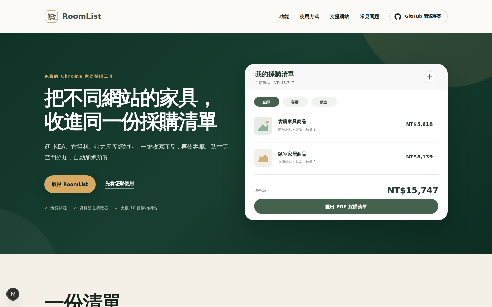

# RoomList Website

[RoomList](https://github.com/chienchitung/room-wishlist-extension) 官方介紹網站——一個免費、開源的 Chrome 擴充功能，能把分散在不同電商網站的家具收藏，整理成一份依空間分類的採購清單。本 repository 是該擴充功能的行銷／說明網站，以 Next.js 打造並部署在 Vercel。



## 這個網站是什麼

RoomList 讓使用者在逛 IKEA、宜得利、特力屋等家居電商時，一鍵把喜歡的商品加入共用清單，不必再開十幾個分頁比對。本網站說明它的功能、使用方式與支援的網站，並提供安裝連結與隱私權政策頁。

### 核心功能

- **跨站收藏**：在支援的電商商品頁，一鍵加入共用清單，不必再開十幾個分頁比對。
- **依空間分類**：客廳、臥室、書房或自訂空間，讓每一件家具都有清楚的歸屬。
- **即時掌握預算**：自動計算各空間小計與總額，保留商品來源、價格與原始連結。
- **匯出與分享**：整理完成後匯出 PDF，或透過 Email 分享清單，和家人或設計師一起討論。

### 支援的購物網站

IKEA、PChome 24h、momo、宜得利家居、特力屋、MR.LIVING、hoi! 好好生活、淘寶・天貓、蝦皮購物、酷澎。

RoomList 完全免費、開源，資料只保存在使用者的瀏覽器（`chrome.storage.local`），沒有開發者後端伺服器，也不會上傳或出售使用者資料。

### 頁面結構

- `/`：首頁，介紹產品功能、使用步驟、支援網站與常見問題。
- `/privacy`：隱私權政策頁。

擴充功能本身的原始碼與安裝方式，請見 [room-wishlist-extension](https://github.com/chienchitung/room-wishlist-extension)。

## 技術棧

- [Next.js](https://nextjs.org/) 16（App Router）
- React 19、TypeScript
- Tailwind CSS 4

## 本機執行

需要 Node.js 22。

```bash
npm install
npm run dev
```

開啟 <http://localhost:3000> 即可預覽。

## 建置檢查

```bash
npm run build
npm run lint
```

## 部署到 Vercel

### 方法一：透過 GitHub（建議）

1. 將 repository 匯入 Vercel（**Add New → Project**）。
2. Framework Preset 選擇 **Next.js**（通常會自動判斷）。
3. 不需要設定環境變數，直接按下 **Deploy**。

### 方法二：使用 Vercel CLI

```bash
npm install
npx vercel        # 預覽部署
npx vercel --prod  # 正式部署
```

## 授權與聲明

本網站與原始碼為獨立開發者所有，與文中提及的電商品牌皆無隸屬、合作、贊助或授權關係。
